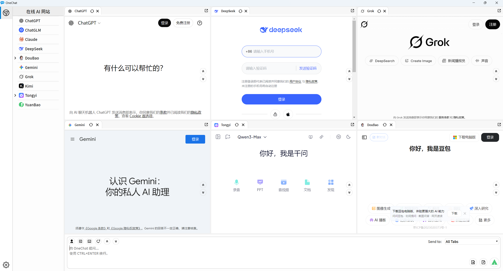
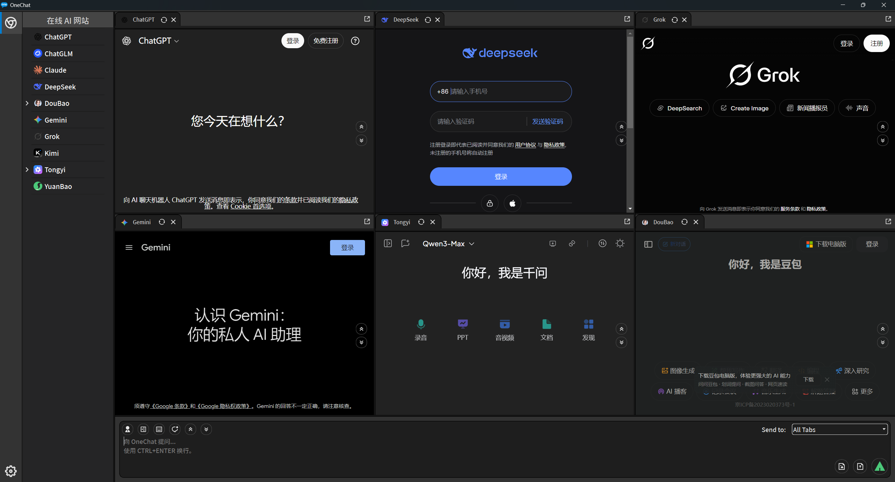
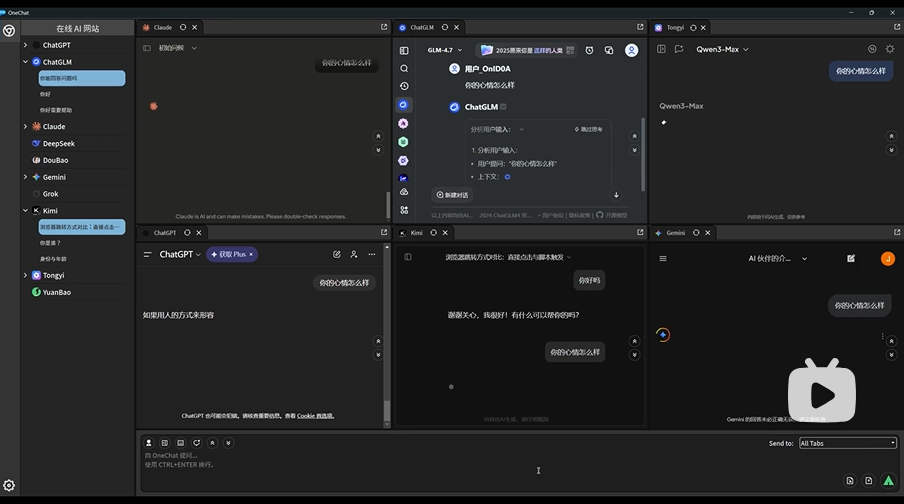

<div align="center">
  
  <p align="center"><strong>一方提问，多方回答</strong></p>


[English](README.md) | 简体中文

</div>

**OneChat**，功能如其名，是一款可以同时与多个在线大模型网站对话的工具。OneChat 可以把您的问题一次性发给多个 AI 页面，助您发现最好的回答。
不仅如此，OneChat 也支持一键控制所有页面的侧边栏显示与隐藏，输入框显示与隐藏，切换新对话，文件上传，对话列表快速定位等功能。


## 📷 屏幕截图

|白色主题|黑色主题|
|--|--|
|||

## 📺 功能视频介绍

[](https://www.bilibili.com/video/BV1TCraBBE4G)

## ⬇️ 下载和运行

**v0.0.1 版本只支持 windows 平台运行：**

- 下载地址： https://github.com/YiangQi/OneChat/releases/tag/v0.0.1 
- 选择 onechat_0.0.1.zip 点击下载；
- 解压后选择 OneChat.exe 双击运行即可；

## 🔥 特性

- 一键发送问题到各个页面进行回答
- 一键打开所有页面登录窗口
- 一键打开或隐藏所有页面侧边栏
- 一键打开或隐藏所有页面输入框
- 一键上传图片或文件
- 一键定位到上一个或下一个问题
- 输入框内容实时同步到各个页面输入框
- 自由选择发送消息到当前打开的页面
- 侧边栏展示当前 AI 对话历史记录
- 页面可拖拽自定义位置及大小

## 大模型网站支持

OneChat 支持的大模型网站可通过 JSON 进行动态配置，配置目录在工具根目录 online 文件夹下。
该目录下 online.json 文件即为模型配置文件，如果要自定义新的网站模型可以参考此配置。

当前支持的模型为：

- ChatGPT
- ChatGLM
- Claude
- DeepSeek
- DouBao
- Gemini
- Kimi
- Grok
- TongYi
- YuanBao

OneChat 同时支持动态地添加其它的大模型网站，当修改了 online.json 配置后，重启软件即可生效。

## 添加新模型网站方式

- 在 online 文件夹下新建一个模型目录，格式为 {供应商名称}_{模型名称}, 如 openai_chatgpt，该目录名称格式非必须，只是保持格式统一；
- 模型目录需要包含两个文件，一个是 inject.js，另一个是 logo.png，为模型图标；
- inject.js 需要重写 inject_template.js 下的接口方法来实现对模型网站操作的注入脚本；
- 在 online.js 中加入当前模型的配置选项，格式如下：

  ```
  {
    "name": "ChatGPT",
    "url": "https://chat.openai.com/",
    "icon": "openai_chatgpt/logo.png",
    "script": "openai_chatgpt/inject.js"
  },
  ```
其中：
- name 为大模型名称，会显示到 OneChat 侧边栏
- url 为大模型网站的对话地址
- icon 为大模型 logo 地址
- script 为大模型注入脚本的地址

由于个人精力有限，欢迎大家提供新的大模型网站。


## 隐私

OneChat 不会读取您的任何个人信息，模型网站的所有登录个人数据均保存在工具根目录 webcache 文件夹下。如有需要，您可以手动将该文件夹删除来清空个人数据。
webcache 目录下有个 WebView 文件夹，里面会按照大模型网站域名作为独立文件夹进行保存，您可以删除 WebView 指定文件夹下的数据来重置对应网站数据。

## 编译

- OneChat 客户端代码采用 Qt 5.15.2 及 MSVC2019_64 版本进行编译。
- OneChat 引用了第三方库 [QCefView](https://github.com/CefView/QCefView)： https://github.com/CefView/QCefView 作为浏览器引擎，并针对 QCefView 一些功能细节做了调整，采用 cef122 版本。
具体可参考该仓库 fork 地址：https://github.com/YiangQi/QCefView/tree/onechat , onechat 分支。
OneChat 3rdparty 目录下的 qcefview 由该 fork 仓库编译。 
- 运行时需要在 debug/release 目录下放置对应的 CefView 模块， 模块目录需要命名为 CefView (大小写敏感)，您可以直接在 github 进行拷贝:

  + windows x64 debug cefview：https://github.com/YiangQi/OneChat/releases/tag/v0.0.1/CefView_win_x64_debug.zip
  + windows x64 release cefview：https://github.com/YiangQi/OneChat/releases/tag/v0.0.1/CefView_win_x64_release.zip

- 如果想要运行 release 版本，请先将 build/debug/online 目录拷贝到 build/release 目录下，否则运行时将不存在网站列表。


